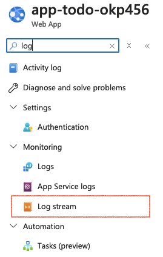

# Azure workshop

This workshop gives an introduction to Microsoft Azure with [Terraform](https://www.terraform.io/). It will guide you through creating a web app serving an API in a container, a database for the API, a frontend connecting to the API and some custom domains for your app. If you have time at the end, you can set up HTTPS, virtual networking, and more.

*Note:* The DNS parts of the workshop requires some extra resources for custom domain names managed by the workshop facilitators. If you are working through this workshop on your own, you will have to set up your own DNS zone with a custom domain name. You will also need to get access or sign up to Azure on your own.

## Getting started

### Required tools

For this workshop you'll need

* An editor of your choice
    * VS Code and IntelliJ both have good Terraform plugins
* Git (any distribution: command-line, editor built-in, etc)
* [Azure CLI](https://learn.microsoft.com/en-us/cli/azure/install-azure-cli)
* [Terraform](https://developer.hashicorp.com/terraform/tutorials/aws-get-started/install-cli)

On macOS, with `brew`, you can run `brew install azure-cli terraform` to install Azure CLI and Terraform.

### Authenticating in the Azure portal

1. You will receive access to Azure. Depending on where the workshop is run, you might have received credentials from a workshop facilitator or received an email with a signup link that gives you access. Note: This email looks like phishing, but will be sent to your specified email from `invites@microsoft.com` and invite you to the "Bekk Terraform Workshop" organization (domain: `bekkterraformworkshop.onmicrosoft.com`).

2. Log in to the Azure Portal. Go to [portal.azure.com](https://portal.azure.com) and log in.

3. In the portal, verify that you're logged in to the "Bekk Terraform Workshop" tenant in the top-right corner.

    

    1. If you're signed in with a different/user email, click your profile image, then "Sign in with a different account". Log in with the correct email/credentials.

    2. If you're in another tenant, click your profile image, then "Switch directory" and then choose "Bekk terraform workshop" on the next page.

    3. If you don't have access when logging in with an email account, please find the email sent to you (see step 1) and click the signup link. If you still can't sign in to the correct tenant, ask a workshop facilitator.

### Authenticating with the Azure CLI

1. Run `az login`. A browser should open and initiate a sign-in process.

2. Run `az ad signed-in-user show` to get information about your user.

3. Run `az account show` to verify that you're successfully logged in, and that you're connected to the `iac-workshop` subscription. If you're not connected to the correct subscription, run `az account set -s iac-workshop` to change subscription, followed by `az account show` to verify.

## Terraform

Start by cloning this repository if you haven't already done so, either using your preferred way using a GUI or any of the commands below:

* Using the [GitHub CLI](https://cli.github.com): `gh repo clone bekk/azure-workshop`
* Using SSH keys: `git clone git@github.com:bekk/azure-workshop`
* Using HTTPS: `git clone https://github.com/bekk/azure-workshop`

This repository has a couple a folders: `frontend_dist/` contains some pre-built frontend files that we'll upload, `infra/` will contain our terraform code, and if you have trouble you can peek in the `solutions` folder. 

The `infra/` folder should only contain the `terraform.tf`. All files should be created in this folder, and all terraform commands assume you're in this folder, unless something else is explicitly specified. 

> [!TIP]
> Resources can be declared in any file inside a module (directory). For small projects, everything can declared in a single file (conventionally named `main.tf`). There are some [file naming conventions in the terraform style guide](https://developer.hashicorp.com/terraform/language/style#file-names).

> [!NOTE]
> `terraform.tf` contains *provider* configuration. A provider is a plugin or library used by the terraform core to provide functionality. The `azurerm` we will use in this workshop provides the definition of Azure resources and translates resource blocks to correct API requests when you apply your configuration.

Let's move on to running some actual commands 🚀

1. Before you can provision infrastructure, you have to initialize the providers from `terraform.tf`. You can do this by running `terraform init` (from the `infra/` folder!).

    This command will not do any infrastructure changes, but will create a `.terraform/` folder, a `.terraform.lock.hcl` lock file. The lock file can (and should) be committed, while the `.terraform` folder should not be committed.

3. Create a `main.tf` file (in `infra/`) and add the following code, replacing `<yourid42>` with a random string containing only lowercase letters and numbers, no longer than 8 characters. The `id` is used to create unique resource names and subdomains, so ideally at least 6 characters should be used to avoid collisions.

    ```terraform
    locals {
      id = "<yourid42>"
    }

    resource "azurerm_resource_group" "todo" {
      name     = "rg-todo-${local.id}"
      location = "West Europe"
    }
    ```

    The code above creates a *resource group*. An Azure resource group used to group resources that belong together. The resource group is created in the "West Europe" Azure region, and will be named `rg-todo-<yourid42>`.

    > [!NOTE]
    > The `locals` block defines a local variable. You can reference a variable by prefixing it with `local`, e.g. `local.id`. Local variables, like other blocks, can be defined and used anywhere in a terraform module, meaning `local.id` can be referenced in other files you create in the same directory.

4. Run `terraform apply`. Take a look at the output: terraform will refresh the real-world state and compare it to the desired state (given by the code), then give an overview of which changes will be done. In this case, creating a resource group. Write `yes`, when terraform asks whether you want to continue.

    > [!TIP]
    > Running `terraform apply` implicitly both plans and applies the configuration. You can save the plan, and apply it in separate steps if you want to. E.g., `tf plan -out=plan.tfplan` followed by `tf apply plan.tfplan`.

5. Go to the [Azure portal](https://portal.azure.com/) and verify that you can find your resource group. Tip: Using the search bar at the top might be the quickest way to find it.

6. `terraform apply` created a *state file*, `terraform.tfstate` in the `infra/` directory. This file contains terraform's view of the state. Resources you've declared will show up here.

    > [!IMPORTANT]
    > The terraform state file can be different from both the *desired state* (what's declared in the code) and the *actual state* (the resources that's actually there). The desired state is different from the terraform state before you apply your changes. The terraform state is different from the *actual state* when some configuration change has been done manually (i.e., modifying or deleting a resource).

## Backend

The backend is a pre-built Docker image uploaded in the GitHub package registry. We'll run it using an Azure Web App that pulls the image and runs it as a container.

Azure App Service is a backing service for many different services: Web Apps, Logic Apps, Function Apps and more. An app service plan is an abstraction for the underlying hardware, and manages file system storage, operating system, networking, vertical scaling (more memory/CPU) and horizontal scaling (parallelization). Multiple apps can run on a single app service plan, sharing the resources.

Azure Web App is a Platform-as-a-Service (PaaS) solution for running a web application. It manages app settings (environment variables), authentication, identity, custom domains, CORS, and deployment, in addition to app-specific networking rules.

1. Create a new file, `backend.tf`. 

    > [!TIP]
    > The file name is not important. All resources in the same module (directory) can be located in the same file, but for everything except very small configurations it is usually better to use multiple files to structure the code.

2. We'll create a new resource of type `azurerm_service_plan`, named `sp-todo-<yourid42>`. Like this:

    ```terraform
    resource "azurerm_service_plan" "todo" {
      name = "sp-todo-${local.id}"

      resource_group_name = azurerm_resource_group.todo.name
      location            = azurerm_resource_group.todo.location

      sku_name = "B1"
      os_type  = "Linux"
    }
    ```

    Note that the terraform local name (here: `todo`) does not need to be the same as the Azure resource name `sp-todo-<yourid42>`. Also note that the local name of the service plan and the resource group we created previously are the same. Both can be named `todo`, since we have to reference them by prefixing with the type (i.e., `azurerm_resource_group.todo.name` gets the resource group name).

    In order to avoid rewriting all files when we want our app in a different location, we're going to refer to the resource group location. It is a well-established practice, and also beneficial for networking latency, to provision all resources in the same region. 

    The `sku_name` variable defines the vertical scaling, and also the price of the app service plan. At the time of writing, `B1` corresponds to 1 CPU core and 1.75GB RAM for 130 NOK/month. Take a look at the [pricing page](https://azure.microsoft.com/en-us/pricing/details/app-service/linux/) for more information.

3. Run `terraform apply` and verify that it's created correctly in the portal.

4. The web app will be created similarly. Notice that we have to reference the `id` of the service plan we just created, to connect the web app to the app service plan.

    ```terraform
    resource "azurerm_linux_web_app" "todo" {
      name = "app-todo-${local.id}"

      resource_group_name = azurerm_resource_group.todo.name
      location            = azurerm_resource_group.todo.location

      # Note: We're referencing the previously created app service plan 
      service_plan_id     = azurerm_service_plan.todo.id

      https_only = false


      site_config {
        application_stack {
          docker_image_name   = "bekk/k6-workshop-todo-backend:latest"
          docker_registry_url = "https://ghcr.io"
        }
      }
    }
    ```

    > [!NOTE]
    > `azurerm_service_plan.todo.id` references a *read-only* attribute (somtimes called an exported attribute), an attribute automatically generated or provided by either the infrastructure provider (e.g., Azure) or the Terraform provider (i.e `azurerm`) as a helping attribute. They can be found in the documentation for a given resource (e.g., [for `azurerm_service_plan`](https://registry.terraform.io/providers/hashicorp/azurerm/latest/docs/resources/app_service_plan#attributes-reference)) All attributes can be referenced, but exported attributes are only available after the resource has been created.

5. `terraform apply` will create the web app and pull the image specified in the `application_stack` block.

    > [!IMPORTANT]
    > The image might take a couple of minutes to pull and start. We'll move on to the database meanwhile.


## Database

The most commonly used database in Azure is the Azure SQL database, which is a SQL Server-based database. Azure also has Postgres, MySQL and other offerings, but the Azure SQL offering is more mature and generally easier to work with in Azure.

To provision a database, you have to provision an SQL server resource first. The SQL server manages the firewall, administrator access and backups among other things. It does not, however, have a SKU and does not cost anything. The scaling (and pricing) is managed by each database. Multiple databases can be connected to the same SQL server.

We will provision an SQL server that has your personal user as an administrator. We will also create an administrator username and secret that our web app can use. Finally, to simplify a little bit we'll open the database for traffic from everywhere on the internet.

> [!CAUTION]
> Opening the database for traffic from everywhere is **bad**, and not something that should be done in production. Neither is using a developer directly as an administrator, nor using username/password to authenticate apps. The extra tasks at the end of the workshop describe how to set up virtual networks and proper identity management to protect the database.

1. To give your personal user access, we need to figure out what the ID of your user is. Every user, group, service principal (representing an application identity) and other identity have a unique UUIDv4 identifying it, sometimes `id` is used, but for some resource types `objectId` is used to distinguish it from other IDs (e.g., `applicationId`).

    The Azure CLI can be used for many operations in Azure, and you can do almost every operation you can do with terraform or the Azure Portal using the CLI. It is logically grouped, and self documented. E.g., `az ad` works with Microsoft Entra Id (prevously Azure Active Directory). Try running `az ad signed-in-user --help` to see the documentation.

    To view your user, run `az ad signed-in-user show`. This will output your user information in JSON format. We want the ID. It is also possible to parse the JSON using [JMESPath](https://jmespath.org/). To retrieve just the id, run `az ad signed-in-user show --query id --output tsv`. The JMESPath query is simple, just `id` to get the id from the JSON object. `--output tsv` tells `az` to format the output using tab-separated values, which is a handy way to remove quotes from quoted strings for scripts.

    Save the ID, you'll need it in a later step.

2. To generate the administrator password, we'll generate a random string. Add the [Random provider](https://registry.terraform.io/providers/hashicorp/random/latest/docs) to the `required_providers` block in `terraform.tf`.

    ```terraform
    random = {
      source = "hashicorp/random"
      version = "3.6.3"
    }
    ```

    Run `terraform init` to install the provider.

3.  Now, we can create a `random_password` resource to generate our password. Add the following code to `database.tf`:

    ```terraform
    resource "random_password" "sql_server_admin_password" {
      length  = 24
      special = false
    }
    ```

    This will create a random, 24-character password, which by default will contain uppercase, lowercase and special characters. The connection string cannot contain certain special characters without additional escaping, so we'll disable those. 

    > [!CAUTION]
    > Generating and using passwords in Terraform will store them in plaintext in the terraform state. This means that state storage should be properly protected with minimal access policies. The benefit of this is that we can give the secret in plain text (during provisioning) to other services that need it authenticate towards the database.
    >
    > After the next `terraform apply`, open `terraform.tfstate` that the passord is stored in the `result` property. Also notice that `result` property is in the `sensitive_attributes` list meaning the generated password is considered *sensitive* by terraform, meaning it will be specially handled and not accidentally printed during e.g., `terraform apply`. Usually it will be replaced as `(sensitive value)`.


4. Finally, let's create the SQL server. Change the `login_username` and `object_id` properties before running `terraform apply`:

    ```terraform
    resource "azurerm_mssql_server" "todo" {
      # Name, resource group and location
      name                = "sql-todo-${local.id}"
      resource_group_name = azurerm_resource_group.todo.name
      location            = azurerm_resource_group.todo.location

      # The SQL server version
      version = "12.0"

      # The (unsecure) administrator username and password
      administrator_login          = "unsecure-admin"
      administrator_login_password = random_password.sql_server_admin_password.result

      # The Entra ID (Azure AD) based administrator setup
      azuread_administrator {
        # Setting this to true will disable the administrator password-based login
        azuread_authentication_only = false
        # CHANGE THESE
        login_username              = "<any-user-name>"
        object_id                   = "<your-object-id-from-step-1>"
      }

      # Recommended security setting
      minimum_tls_version           = "1.2"
      # Is not enough to open the database to the public internet (despite the
      # name), but lets us configure firewall rules in a later step
      public_network_access_enabled = true
    }
    ```

    > [!NOTE]
    > Creating a database server and/or a database can take some time, often a couple of minutes and occasionally up to ten minutes. If provisioning is slow, read on while waiting. If you want to, take a look at [the documentation for the `azurerm`-provider](https://registry.terraform.io/providers/hashicorp/azurerm/latest) and try to find the `azurerm_mssql_server` and `azurerm_mssql_database` resources.

5. Creating a Basic-tier database is rather simple, using the default settings:

    ```terraform
    resource "azurerm_mssql_database" "todo" {
      name      = "db-todo"
      server_id = azurerm_mssql_server.todo.id
      sku_name  = "Basic"
    }
    ```

    Running `terraform apply` can take some time to finish.

6. Let's create a SQL server firewall rule to open for all external IP addresses:

    ```terraform
    resource "azurerm_mssql_firewall_rule" "todo" {
      name             = "All IPv4 addresses"
      server_id        = azurerm_mssql_server.todo.id
      start_ip_address = "0.0.0.0"
      end_ip_address   = "255.255.255.255"
    }
    ```

## Connecting the backend to the database

Hopefully the web app is up and running by now. We'll take a look at the logs and configure it with required settings for the database connection.

1. Go to the Azure portal, find the web app and find "Log stream" in the "Monitoring section of the left hand menu. Using the search at the top of the sidebar makes it quicker to find the menu item.

    

    You might get just the "Connected!" message. That might mean the app is still starting, if so, just continue with the next task and check in on the log stream later.

    The log stream should show that the image was pulled, but that the `DATABASE_URL` was not defined when the image started. You should see an error in the log. We've created the database, but haven't configured the app yet.

    > [!NOTE]
    > Log stream is a poor man's logging tool. Usually some other tool is used, often Azure's Application Insights tool or a third-party tool like Splunk, Grafana or Datadog. In this case Log stream is sufficient.


2. If the database is done provisioning, we can configure the web app with the `DATABASE_URL` environment variable to `azurerm_linux_web_app.todo` in `backend.tf.` using *app settings*.

    ```terraform
    resource "azurerm_linux_web_app" "todo" {
      # This resource block was previously created, you only need to add app_settings below the other properties

      app_settings = {
        # The connection string format is set by the database connection manager and will be different for different apps
        DATABASE_URL = "sqlserver://${azurerm_mssql_server.todo.fully_qualified_domain_name}:1433;database=${azurerm_mssql_database.todo.name};user=${azurerm_mssql_server.todo.administrator_login};password=${random_password.sql_server_admin_password.result};encrypt=true;trustServerCertificate=false;hostNameInCertificate=*.database.windows.net;loginTimeout=30"
      }
    }
    ```

    This will construct the required SQL server connection string. Note that we reference the SQL server domain name, the database name and the administrator login and password using [string interpolation syntax](https://developer.hashicorp.com/terraform/language/expressions/strings#string-templates).

3. After running `terraform apply`, navigate to the web app in the Azure Portal, and find "Settings > Environment variables" in the sidebar. Verify that the `DATABASE_URL` is registered as an application setting. Then go to the "Log stream" again to verify that the app started without errors. The container runs migrations on startup.

    Finally, go to the overview (the main page) of the web app. And go to the default domain listed there (`<yourid42>.azurewebsites.net`). The root URL is not valid so you'll get "Cannot GET /" or similar. Try the `/healthcheck`, which should report "Database connection OK".


## Frontend

We will use blob (object) storage to host our web site. An Azure Storage Account can host file shares, queues, blobs and tables. Blobs are organized into "Containers". Each container can contain many blobs. A blob can be a text file (HTML, javascript, txt), an image, a video or any other file. Azure Storage containers provides similar functionality to AWS S3 or Google Cloud Storage.

Storage accounts can replicate data across zones as regions. For backups, irreplaceable data, etc. replication across zones or regions should be considered. You can also choose between a standard and premium tier. The standard tier is usually sufficient for most use cases, but the premium performance tier can be considered if for applications with a lot of writes or latency sensitivity. Individual blobs also has access tiers, affecting the availability of the data, storage and access cost. All in all, the storage account pricing can be rather complicated, but in practice it is rather cheap and tweaking should only be necessary when the cost grows to high or performance is a problem. For hosting a static website behind a CDN, the cost is near zero.

When serving a static web site from a storage account, we will need to enable the "Static Website" feature and allow for public access. We will also use terraform to upload the files in the `frontend_dist/` folder in the GitHub repository.

We use a CDN in front of the storage account to provide a custom domain for the frontend. The CDN has multiple settings for doing redirects, caching and more that we (mostly) won't touch in this workshop, but are should be looked at for production use cases.

An Azure CDN has a profile, which represents the CDN and controls the pricing tier and groups CDN endpoints resources. Each endpoint represents content from a different source (origin), different caching rules, compression settings and custom domains.

1. Creating the storage account is straight forward. We need to enable static website and public access to blobs. Add this to a new file, `frontend.tf`:

    ```terraform
    resource "azurerm_storage_account" "todo_frontend" {
      name = "sttodo${local.id}"
      resource_group_name             = azurerm_resource_group.todo.name
      location                        = azurerm_resource_group.todo.location
      account_tier                    = "Standard"
      account_replication_type        = "LRS"
      allow_nested_items_to_be_public = true
      enable_https_traffic_only       = false # We'll change this in a later task
      min_tls_version                 = "TLS1_2"

      static_website {
        index_document = "index.html"
      }
    }
    ```

    Local redundant storage (LRS) with replication inside a single data center is sufficient, since we're not afraid of data loss (web page can be re-uploaded somewhere else). [Other options are available](https://learn.microsoft.com/en-us/azure/storage/common/storage-redundancy) for data with high availability or durability needs. We need to enable access to nested items (blobs) to serve data as a web page.

2. To upload files, terraform must track the files in the `frontend_dist/` directory. We also need some MIME type information that is not readily available, so we will create a [*map*](https://developer.hashicorp.com/terraform/language/expressions/types#maps-objects) (also known as an *object*) that we can use to look up the types later. We will create local variables to help us out:

    ```terraform
    locals {
      # 'path.module' is the path to the current module, i.e., the path to the 'infra/' directory
      frontend_dir   = "${path.module}/../frontend_dist"
      # get all files in the `frontend_dist` dir
      frontend_files = fileset(local.frontend_dir, "**")

      # this is a map (key-value pairs)
      mime_types = {
        ".js"   = "application/javascript"
        ".html" = "text/html"
      }
    }
    ```

    > [!NOTE]
    > Terraform has many [built-in functions](https://developer.hashicorp.com/terraform/language/functions) to simplify working with strings, numbers, dates IP addresses and more.
    >
    > [`fileset(directory, pattern)` is a filesystem function](https://developer.hashicorp.com/terraform/language/functions/fileset) returns a list of all files in `directory` matching `pattern`.

3. Each file we want to upload is represented by a `azurerm_storage_blob` resource. In order to create multiple resources, terraform provides a `for_each` meta-argument as a looping mechanism. We assign the `frontend_files` list to it, and can use `each.value` to refer to an element in the list.

    ```terraform
    resource "azurerm_storage_blob" "frontend_files" {
      for_each = local.frontend_files

      name                   = each.value
      storage_account_name   = azurerm_storage_account.todo_frontend.name
      storage_container_name = "$web"
      type                   = "Block"

      source                 = "${local.frontend_dir}/${each.value}" # each.value will be a filename

      # Look up each MIME type, regex to extract the file ending
      content_type           = lookup(local.mime_types, regex("\\.[^.]+$", each.value), null)

      # content_md5 attribute is not required in this workshop, but is used to detect file changes (filename equal, content changed)
      content_md5            = filemd5("${local.frontend_dir}/${each.value}")
    }
    ```

    After `terraform apply` is done, navigate to the storage account in the Azure Portal, find "Containers" in the sidebar and select the "$web" container. Verify that you see your files there.

    Navigate to "Static website" in the sidebar, and find the "Primary endpoint". Copy it into a new tab in the browser, and verify that you get the "k6 demo todo frontend". Ignore the network error for now, that won't work before we've set up DNS properly.

4. We'll do the CDN configuration in one go:

    ```terraform
    resource "azurerm_cdn_profile" "todo_cdn_profile" {
      name                = "cdnp-todo-${local.id}"
      location            = azurerm_resource_group.todo.location
      resource_group_name = azurerm_resource_group.todo.name
      # Microsoft is fastest to get up and running for the workshop. Also cheapest, 
      # and we don't need special features provided by other alternatives
      sku = "Standard_Microsoft"
    }

    resource "azurerm_cdn_endpoint" "todo_cdn_endpoint" {
      name                = "cdne-todo-${local.id}"
      location            = azurerm_resource_group.todo.location
      resource_group_name = azurerm_resource_group.todo.name
      profile_name        = azurerm_cdn_profile.todo_cdn_profile.name

      # Configure the CDN endpoint to point to the storage container
      origin_host_header = azurerm_storage_account.todo_frontend.primary_web_host
      origin {
        name      = "origin"
        host_name = azurerm_storage_account.todo_frontend.primary_web_host
      }

      # Not required, and probably not what you want in production, but simplifies debugging configuration
      global_delivery_rule {
        cache_expiration_action {
          behavior = "BypassCache"
        }
      }
    }
    ```

5. Run `terraform apply`, and navigate to the CDN profile (of type "Front Door and CDN profile" in the Azure portal). Find your endpoint from the list, and use the "Endpoint hostname" on the endpoint overview page (`cdne-todo-<yourid>.azureedge.net`) to verify that the CDN serves the frontend correctly. 

## DNS

The domain name we will use, `cloudlabs-azure.no`, is already configured in a DNS zone. You can find the DNS zone inside the `workshop-admin` resource group. We will configure two CNAME records. `api.<yourid42>.cloudlabs-azure.no` for the backend web app, and `<yourid42>.cloudlabs-azure.no` for the frontend CDN.

1. In order to define subdomain names, we need a reference to the DNS zone in our Terraform configuration. We will use a Terraform `data` block. A data block is very useful to refer to resources created externally, including resources created by other teams or common platform resources in an organization. Most resources in the `azurerm` provider have a corresponding data block.
    
    A DNS zone, can be uniquely identified by it's name and the parent resource group name. Add the following in `dns.tf`:
    
    ```terraform
    data "azurerm_dns_zone" "cloudlabs_azure_no" {
      name                = "cloudlabs-azure.no"
      resource_group_name = "workshop-admin"
    }
    ```

2. We can now create a CNAME record for the backend API:

    ```terraform
    resource "azurerm_dns_cname_record" "todo-api" {
      zone_name = data.azurerm_dns_zone.cloudlabs_azure_no.name
      resource_group_name = data.azurerm_dns_zone.cloudlabs_azure_no.resource_group_name

      ttl = 60
      name = "api.${local.id}"
      record = azurerm_linux_web_app.todo.default_hostname
    }
    ```

3. If you navigate to the new domain, `api.<yourid42>.cloudlabs-azure.no`, you will get an error. The web app must also know which custom domain it is served from. Add this resource in `backend.tf`:

    ```terraform
    resource "azurerm_app_service_custom_hostname_binding" "todo-api" {
      hostname = "${azurerm_dns_cname_record.todo-api.name}.${data.azurerm_dns_zone.cloudlabs_azure_no.name}"

      resource_group_name = azurerm_resource_group.todo.name
      app_service_name    = azurerm_linux_web_app.todo.name
    }
    ```

    > [!IMPORTANT]
    > The provisioning order matters. The custom hostname binding must be provisioned after the CNAME record. This is a limitation (design decision) in Azure. 
    >
    > Terraform will try to provision resources in parallel if possible. Resource blocks that refer to other objects will be implicitly ordered. In this case, we created an implicit dependency by referring to the `azurerm_dns_cname_record.todo-api.name` attribute in the resource block.
    >
    > Explicity dependencies can be created when needed with [the `depends_on` meta-argument](https://developer.hashicorp.com/terraform/language/meta-arguments/depends_on). You can read more in [the resource behavior documentation](https://developer.hashicorp.com/terraform/language/resources/behavior#resource-dependencies).

4. Using a CNAME record for a CDN works similarly: 

    In `dns.tf`:

    ```terraform
    resource "azurerm_dns_cname_record" "todo_cdn" {
      zone_name = data.azurerm_dns_zone.cloudlabs_azure_no.name
      resource_group_name = data.azurerm_dns_zone.cloudlabs_azure_no.resource_group_name

      ttl = 60
      name = "${local.id}"
      record = azurerm_cdn_endpoint.todo_cdn_endpoint.fqdn
    }
    ```

    In `frontend.tf`:

    ```terraform
    resource "azurerm_cdn_endpoint_custom_domain" "todo_frontend" {
      name            = local.id
      cdn_endpoint_id = azurerm_cdn_endpoint.todo_cdn_endpoint.id
      host_name       = trimsuffix(azurerm_dns_cname_record.todo_cdn.fqdn, ".")
    }
    ```

    > [!NOTE]
    > If you apply these together, you might get an error. Even with the implicit dependency the CDN endpoint might try to verify the existence of the CNAME record before it's ready and Azure will return a "BadRequest" error. Terraform will print the message and quit. If you get this message, just apply the configuration again.

5. Apply the configuration and navigate to `<yourid42>.cloudlabs-azure.no` and verify that you can access the website and that the connection works!


## Extras

### Cleaning up you resources

Normally, all resources can be deleted using `terraform destroy`.

Azure requires CNAME records to be created before the CDN endpoint custom domain. When destroying, terraform reverses the dependency graph and will try to destroy the CDN endpoint custom domain first, and then the CNAME record. However, Azure requires the CNAME records to be deleted before destroying the custom domain name resource.

To fix this, go into the Azure portal and delete the `<yourid42>` CNAME record resource manually. You can find it on the DNS zone resource in the `workshop-admin` resource group. Afterwards, run `terraform destroy`.

### Virtual network integration

Take a look at the [virtual network integration documentation](https://learn.microsoft.com/en-us/azure/app-service/overview-vnet-integration#how-regional-virtual-network-integration-works) for an explanation of how it works.

The virtual network integration feature is managed by the [`azurerm_app_service_virtual_network_swift_connection` resource](https://registry.terraform.io/providers/hashicorp/azurerm/latest/docs/resources/app_service_virtual_network_swift_connection). Take a look at the example, and create a virtual network with a subnet and the vnet integration.

Then, create a [`sql_virtual_network_rule` resource](https://registry.terraform.io/providers/hashicorp/azurerm/latest/docs/resources/sql_virtual_network_rule.html) to allow traffic from the virtual network to access the SQL server.

Finally, remove the previous `azurerm_mssql_firewall_rule` to close connections from the public internet.

Verify that the database connection works by going to  `https://<yourid42>.cloudlabs-azure.no`.


### Backend with HTTPS on custom domain

To get HTTPS for a web app, you need to create an [`azurerm_app_service_managed_certificate`](https://registry.terraform.io/providers/hashicorp/azurerm/latest/docs/resources/app_service_managed_certificate). Take a look at the example in the [provider documentation](https://registry.terraform.io/providers/hashicorp/azurerm/latest/docs/resources/cdn_endpoint_custom_domain) and make sure to provision the `azurerm_app_service_managed_certificate_binding` too, for HTTPS to work correctly.

Verify by going to `https://api.<yourid42>.cloudlabs-azure.no/healthcheck`.

### Frontend with HTTPS on custom domain

:information_source: To do this task, the backend needs to support HTTPS.

The [cdn_endpoint_custom_domain](https://registry.terraform.io/providers/hashicorp/azurerm/latest/docs/resources/cdn_endpoint_custom_domain) resource has a `cdn_managed_https` argument. Use a dedicated certificate using the server name indication protocol. *Note:* Provisioning the certificate can take up to an hour, so you might want to do this task last.

Verify by going to `https://<yourid42>.cloudlabs-azure.no`.

<!--
### WIP

Unfinished, ask your workshop facilitator!

### Modules
### Refresh-only
### Variables
### Web app healthcheck
### Scaling
### Slots
standard plan
### Budgets
### Get azure ad user id using Azure AD
### Tags
### Azure AD authentication only
### Keyvault with connection string
-->
